# Stellar [Documentation](https://developers.stellar.org/docs/) and [API Reference](https://developers.stellar.org/api/)

# Contents

- [Stellar Documentation and [API Reference](https://developers.stellar.org/api/)](#stellar-documentation-and-api-reference)
- [Contents](#contents)
- [How to Run](#how-to-run)
  - [Dependencies](#dependencies)
  - [Local Development](#local-development)
  - [Local Production Build](#local-production-build)
- [Structure](#structure)
  - [Page Metadata](#page-metadata)
  - [Folder Metadata](#folder-metadata)
- [Markdown](#markdown)
  - [Basic Components](#basic-components)
    - [Table](#table)
    - [Unordered List](#unordered-list)
    - [Ordered List](#ordered-list)
    - [Images](#images)
    - [Quote](#quote)
    - [Paragraph and Headings](#paragraph-and-headings)
  - [Custom Components](#custom-components)
    - [AttributeTable](#attributetable)
      - [Omitting Data Type](#omitting-data-type)
    - [Alert](#alert)
    - [CodeExample](#codeexample)
    - [Endpoint](#endpoint)
    - [EndpointsTable](#endpointstable)
    - [Example (JSON) Response](#example-json-response)
    - [MethodTable](#methodtable)
    - [Diagrams (Mermaid)](#diagrams-mermaid)
    - [Performance metrics](#performance-metrics)
    - [Testing requests as a crawler](#testing-requests-as-a-crawler)

# How to Run

## Dependencies

To build this project, you must have the following dependencies installed:

- A modern version of node. We recommend the current LTS.
  - We have some binary dependencies, `sharp` for image processing and
    `puppeteer` to render Mermaid charts, which are both somewhat flaky. It's
    possible that one of these will ship a change that mandates a more modern
    version in the future.
- `yarn`

## Local Development

`yarn start` to start local development.

## Local Production Build

The build has been dockerized so we can host with nginx on Kubernetes, which can
be compiled and run with `yarn` scripts. Make sure you have Docker set up on
your machine.

```sh
yarn production
# or
yarn prod:build
yarn prod:serve
```

To run a complete simulation of a production build, make sure to set an
`AMPLITUDE_KEY` environment variable.

# Structure

- `/content` contains
  - Documentation `/docs`
    - Web assets `/docs/web-assets`
  - API Reference `/api`
  - Each page is authored as an `index.mdx` document.

## Page Metadata

- **Title** (og:title, page title): Pulled from front matter.
- **Order** (order in which a page appears in the table of contents): Pulled
  from front matter.
- **URL slug**: Pulled from the folder or file name

**All names must use dashes for spaces instead of spaces or underscores**

```
---
title: Node Monitoring and Diagnostics
order: 40
---
```

## Folder Metadata

Each folder must have a `metadata.json` file with 2 keys:

- **Title** (section title in the table of contents): Pulled from a
  `metadata.json` file in the folder
- **Order** (order in which a section appears in the table of contents): Pulled
  from a metadata.json file in the folder

```json
{
  "order": 0,
  "title": "Introduction"
}
```

If we want to sort pages in an alphabetical order, add `sortMethod` in that
folder's `metadata.json`.

The below example is for
[/glossary](https://github.com/stellar/new-docs/blob/master/content/docs/glossary/metadata.json)
page

```json
{
  "order": 60,
  "title": "Glossary",
  "sortMethod": "alphabetical"
}
```

Folders may be nested, which means that a final URL may be stitched together
from multiple metadata files.

Check `/content` folder to see how its nested order is working

```
content/
├── api/
│    ├── metadata.json
│    └── aggregations/
│        ├── metadata.json
│        ├── index.mdx
│        └── fee-stats/
│          ├── index.mdx
│          ├── metadata.json
│          ├── object.mdx
│          └── single.mdx
└── docs/
    ├── metadata.json
    ├── index.mdx
    ├── web-assets/
    │    └── img.png
    └── building-apps/
      ├── basic-wallet.mdx
      ├── custom-assets.mdx
      ├── index.mdx
      ├── metadata.json
      └── connect-to-anchors/
        ├── deposit-anchored-assets.mdx
        ├── index.mdx
        ├── setup-for-anchored-assets.mdx
        └── metadata.json
```

# Markdown

## Basic Components

### Table

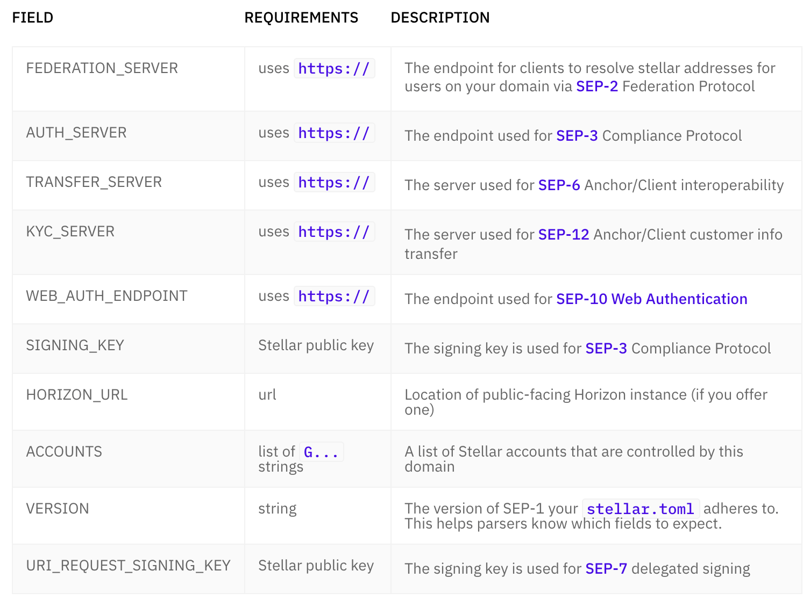

```
| Field | Requirements | Description |
| --- | --- | --- |
| FEDERATION_SERVER | uses `https://` | The endpoint for clients to resolve stellar addresses for users on your domain via [SEP-2](https://github.com/stellar/stellar-protocol/tree/master/ecosystem/sep-0002.md) Federation Protocol |
| AUTH_SERVER | uses `https://` | The endpoint used for [SEP-3](https://github.com/stellar/stellar-protocol/tree/master/ecosystem/sep-0003.md) Compliance Protocol |
| TRANSFER_SERVER | uses `https://` | The server used for [SEP-6](https://github.com/stellar/stellar-protocol/tree/master/ecosystem/sep-0006.md) Anchor/Client interoperability |
| KYC_SERVER | uses `https://` | The server used for [SEP-12](https://github.com/stellar/stellar-protocol/tree/master/ecosystem/sep-0012.md) Anchor/Client customer info transfer |
| WEB_AUTH_ENDPOINT | uses `https://` | The endpoint used for [SEP-10 Web Authentication](https://github.com/stellar/stellar-protocol/tree/master/ecosystem/sep-0010.md) |
| SIGNING_KEY | Stellar public key | The signing key is used for [SEP-3](https://github.com/stellar/stellar-protocol/tree/master/ecosystem/sep-0003.md) Compliance Protocol |
| HORIZON_URL | url | Location of public-facing Horizon instance (if you offer one) |
| ACCOUNTS | list of `G...` strings | A list of Stellar accounts that are controlled by this domain |
| VERSION | string | The version of SEP-1 your `stellar.toml` adheres to. This helps parsers know which fields to expect. |
| URI_REQUEST_SIGNING_KEY | Stellar public key | The signing key is used for [SEP-7](https://github.com/stellar/stellar-protocol/tree/master/ecosystem/sep-0007.md) delegated signing |
```

### Unordered List

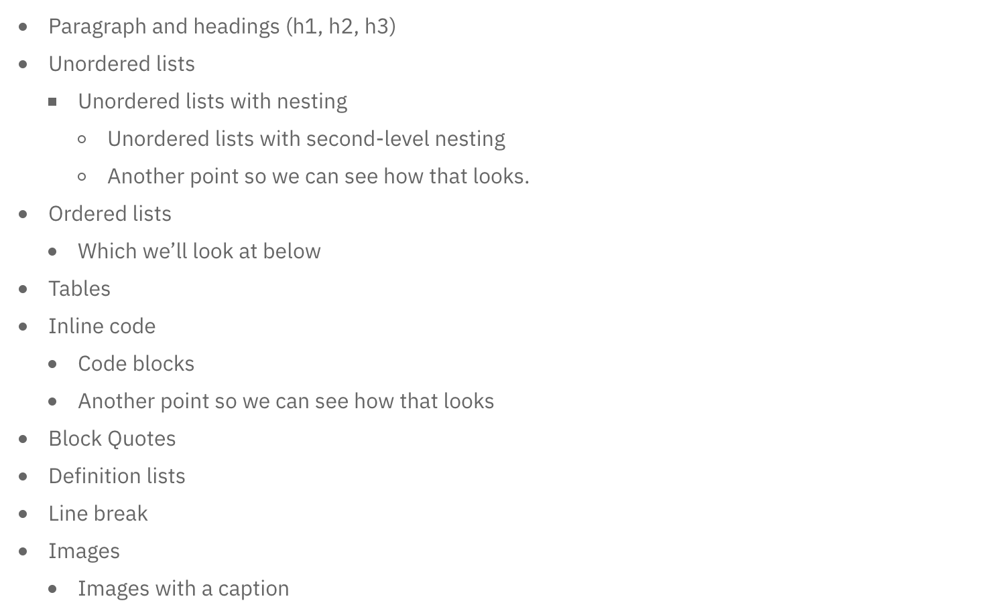

```
- Unordered lists
  - Unordered lists with nesting
    - Unordered lists with second-level nesting
    - Unordered lists with second-level nesting
- Unordered lists #2
  - Unordered lists with nesting #2
- Unordered lists #3
- Unordered lists #4
  - Unordered lists with nesting #4
  - Unordered lists with nesting #4
```

### Ordered List

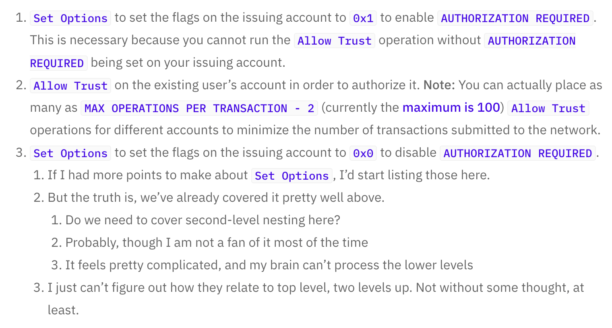

```
1. [`Set Options`](../api/resources/operations/object/set-options.mdx) to set the flags on the issuing account to `0x1` to enable `AUTHORIZATION REQUIRED`. This is necessary because you cannot run the [`Allow Trust`](../api/resources/operations/object/allow-trust.mdx) operation without `AUTHORIZATION REQUIRED` being set on your issuing account.
1. [`Allow Trust`](../api/resources/operations/object/allow-trust.mdx) on the existing user's account in order to authorize it. **Note:** You can actually place as many as `MAX OPERATIONS PER TRANSACTION - 2` (currently the [maximum is 100](concepts/transactions.md#list-of-operations)) `Allow Trust` operations for different accounts to minimize the number of transactions submitted to the network.
1. [`Set Options`](../api/resources/operations/object/set-options.mdx) to set the flags on the issuing account to `0x0` to disable `AUTHORIZATION REQUIRED`.
   1. If I had more points to make about `Set Options`, I'd start listing those here.
   1. Another point
      1. Nested point of Anoter point
      1. Nested point of Anoter point
      1. Nested point of Anoter point
   1. Another point #2
```

### Images

Currently (April, 2020), only
[Documentation](https://developers.stellar.org/docs/) uses images.

1. Drop the images in the `content/docs/web-assets` folder
2. Refer to the asset as `` in
   the proper location in your file - make sure that `web-assets`' relative path
   is correct
3. Captions: Include alt text if you’d like a caption:
   `` Leave the alt
   text section blank if you do not want a caption:
   ``

### Quote


```
> Here's a quote
```

### Paragraph and Headings

Beyond defining title font sizes, line heights, and weights:

- **H1** tags are reserved for the page’s title and should not be used; that
  said, if they are used, they will still show up on the front end as H1 tags
- **H2** tags populate the ride-side page
  [table of contents](https://developers.stellar.org/docs/anchoring-assets/enabling-deposit-and-withdrawal/setting-up-test-server/)
  in Documentation

## Custom Components

Custom (React) components that are being used throughout Documentation and API
Reference.

**Make sure that there is an empty line within the wrapper**

For example,

```
<Alert>
<!-- EMPTY SPACE IS NEEDED BELOW FOR A COMPONENT TO RENDER PROPERLY -->

Note: the testnet is reset every three months, so when building on it, make sure you have a plan to recreate necessary accounts and other data.  For more info, check out the [best practices for using the testnet](../glossary/testnet.mdx#best-practices-for-using-testnet).

<!-- EMPTY SPACE IS NEEDED BELOW FOR A COMPONENT TO RENDER PROPERLY -->
</Alert>
```

### AttributeTable

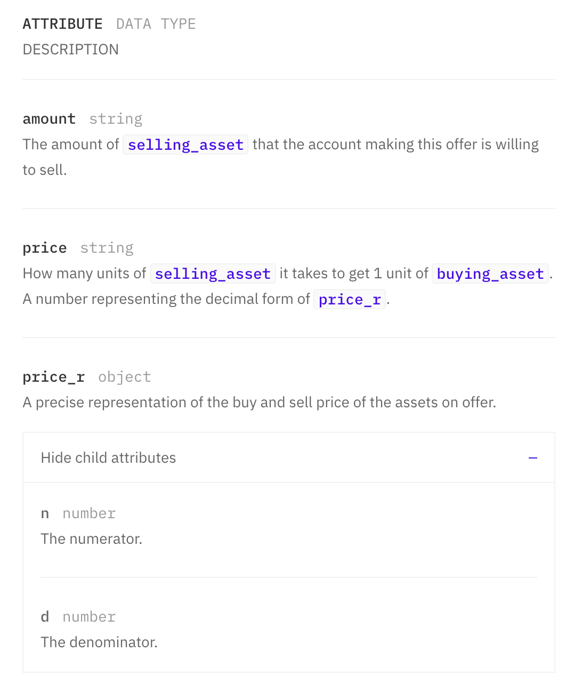

`<AttributeTable/>` explains each attribute or argument that is being used.
Nested table will turn into "child attributes" that are collapsed by default
(See `prices_r` and its child attributes from the example above).

- PropTypes
  - `children` (required)

For example,
[Api Reference > Resources > Operations > Object](https://developers.stellar.org/api/resources/operations/object/)

```
import { AttributeTable } from "components/AttributeTable";

<AttributeTable>

- ATTRIBUTE
  - DATA TYPE
  - DESCRIPTION
- amount
  - string
  - The amount of `selling_asset` that the account making this offer is willing to sell.
- price
  - string
  - How many units of `selling_asset` it takes to get 1 unit of `buying_asset`. A number representing the decimal form of `price_r`.
- price_r
  - object
  - A precise representation of the buy and sell price of the assets on offer.
    - n
      - number
      - The numerator.
    - d
      - number
      - The denominator.

</AttributeTable>
```

#### Omitting Data Type

`Data Type` is not required. If you want to skip it, simply add a text "skip" in
it

```
import { AttributeTable } from "components/AttributeTable";

<AttributeTable>

- TYPE
  - skip
  - OPERATION(S)
- Account Created
  - skip
  - create_account
- Account Removed
  - skip
  - merge_account

  </AttributeTable>
```

Example: `<AttributeTable/>` without type specified on
[API's Manage Data Object](https://developers.stellar.org/api/resources/operations/object/manage-data/).

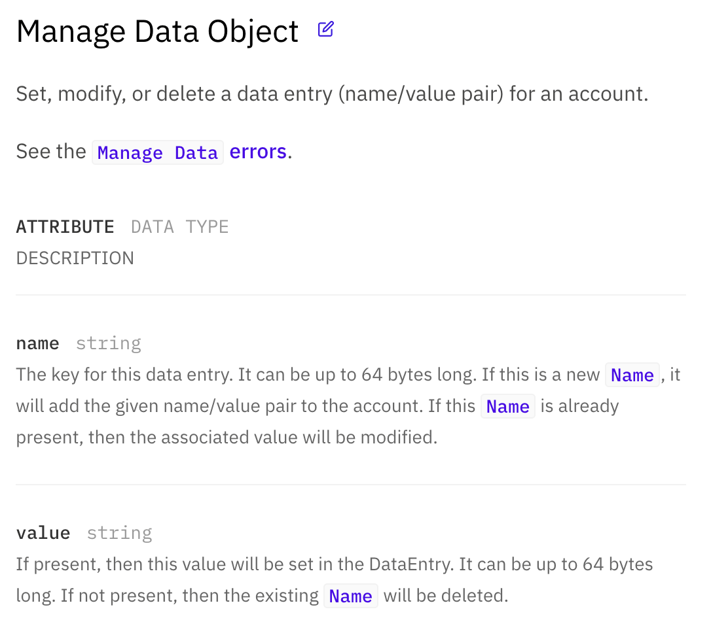

Example: `<AttributeTable/>` with type specified on
[API's Effect Types](https://developers.stellar.org/api/resources/effects/types/).

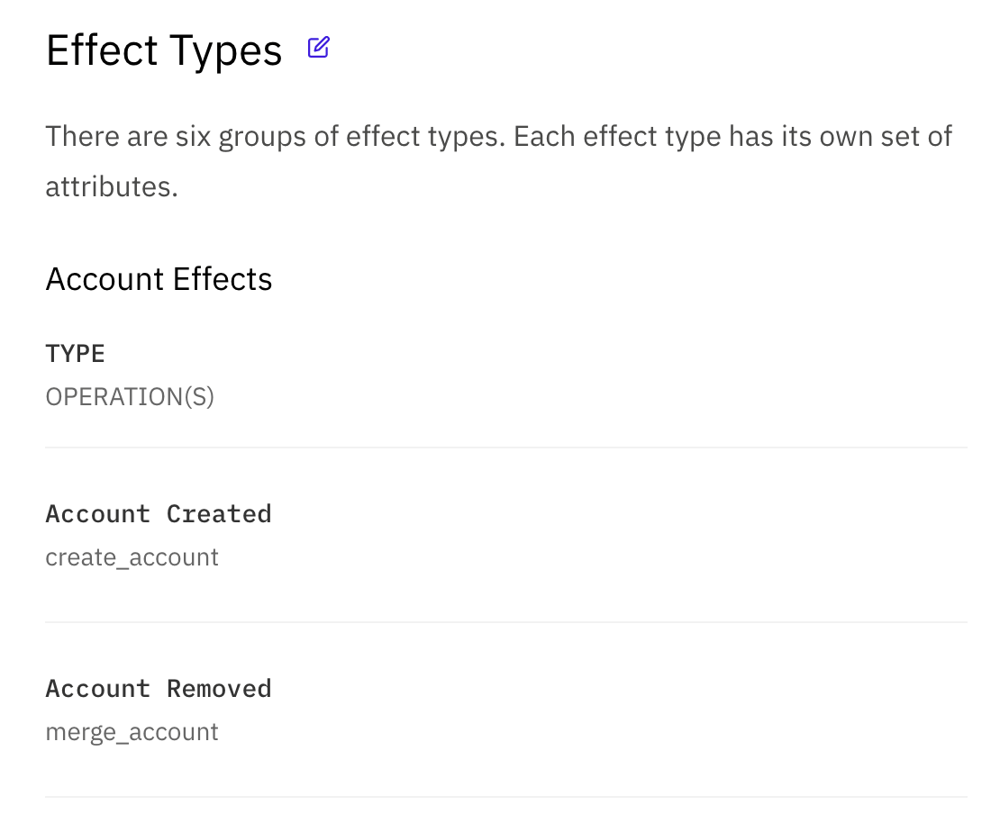

### Alert

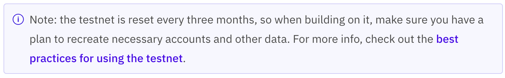

`<Alert/>` is used to convey hints, warnings, and etc.

- PropTypes
  - `children` (required)

For example,
[Setting Up Test Server](https://developers.stellar.org/docs/anchoring-assets/enabling-deposit-and-withdrawal/setting-up-test-server/)

```
import { Alert } from "components/Alert";

<Alert>

Note: the testnet is reset every three months, so when building on it, make sure you have a plan to recreate necessary accounts and other data.  For more info, check out the [best practices for using the testnet](../glossary/testnet.mdx#best-practices-for-using-testnet).

</Alert>
```

### CodeExample

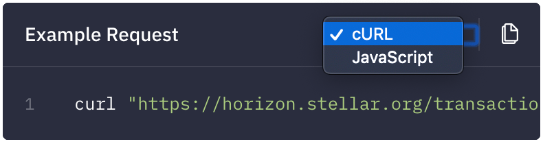

`<CodeExample/>` is a code snippet component. You can include snippets for more
than one language. See an example of including a snippet for `curl` and
`JavaScript` below. It is using
[Prism syntax highlighting library](https://prismjs.com/).

- PropTypes
  - `title` (optional)
  - `children` (required)
  - `href` (optional)

For example,
[Setting Up Test Server](https://developers.stellar.org/docs/anchoring-assets/enabling-deposit-and-withdrawal/setting-up-test-server/)
in Documentation and
[Resources > Transaction > Retrieve a Transaction](https://developers.stellar.org/api/resources/transactions/single/)
in API Reference.

````
import { CodeExample } from "components/CodeExample";

<CodeExample title="Example Request">

```curl
curl "https://horizon.stellar.org/ledgers/27147222/transactions?limit=2"
```

```js
var StellarSdk = require('stellar-sdk')
var server = new StellarSdk.Server('https://horizon.stellar.org')

server
.transactions()
.forLedger('27147222')
.call()
.then(function(resp) {
  console.log(resp)
})
.catch(function(err) {
  console.error(err)
})
```

</CodeExample>
````

Languages that are currently being used in Documentation and API Reference are
below:

```
// https://github.com/stellar/new-docs/blob/master/src/components/CodeExample.js

const CODE_LANGS = {
  bash: "bash",
  cpp: "C++",
  curl: "cURL",
  go: "Go",
  html: "html",
  java: "Java",
  js: "JavaScript",
  json: "json",
  python: "Python",
  scss: "SCSS",
  toml: "TOML",
  ts: "TypeScript",
  tsx: "TSX",
  yaml: "YAML",
};
```

If you would like to add an additional language to this, visit
[CodeExample.js](https://github.com/stellar/new-docs/blob/master/src/components/CodeExample.js)
and add it to `CODE_LANGS`.

### Endpoint

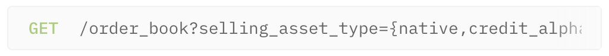

`<Endpoint/>` is currently used in API Reference.

- PropTypes
  - `children` (required)

For example,
[Aggregations > Order Books > Retrieve an Order Book](https://developers.stellar.org/api/aggregations/order-books/single/).

```
import { Endpoint } from "components/Endpoint";

<Endpoint>

|     |                              |
| --- | ---------------------------- |
| GET | /order_book?selling_asset_type={native,credit_alphanum4,credit_alphanum12}&selling_asset_issuer={:account_id}&selling_asset_code{:asset_code}&buying_asset_type={native,credit_alphanum4,credit_alphanum12}&buying_asset_issuer={:account_id}&buying_asset_code{:asset_code}&limit={1-200} |

</Endpoint>
```

### EndpointsTable

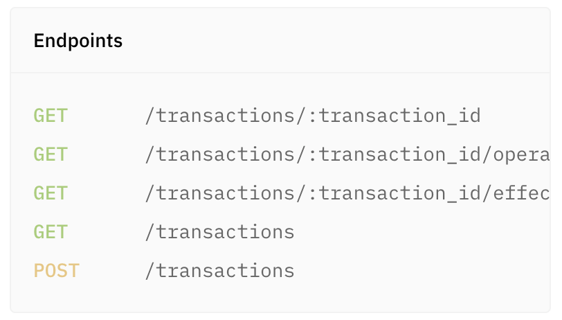

`<EndpointsTable/>` displays an endpoint and its
[HTTP method](https://en.wikipedia.org/wiki/Hypertext_Transfer_Protocol#Request_methods).

- PropTypes
  - `title` (required)
  - `children` (required)

For example,
[Resources > Transactions](https://developers.stellar.org/api/resources/transactions/).

```
import { EndpointsTable } from "components/EndpointsTable";

<EndpointsTable title="Endpoints">

|     |                                                               |
| --- | ------------------------------------------------------------- |
| GET | [/transactions/:transaction_id](./single.mdx)                 |
| GET | [/transactions/:transaction_id/operations](./operations.mdx)  |
| GET | [/transactions/:transaction_id/effects](./effects.mdx)        |
| GET | [/transactions](./list.mdx)                                   |
| POST | [/transactions](./post.mdx)                                  |

</EndpointsTable>
```

### Example (JSON) Response

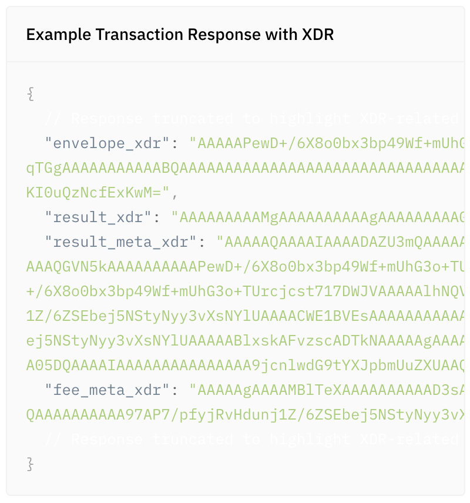

`<ExampleResponse/>` is **only** used in API Reference for JSON response. In
Documentation, we use `<CodeExample/>` for JSON response.

- PropTypes
  - `title` (optional)
  - `children` (required)

For example,
[Introduction > XDR](https://developers.stellar.org/api/introduction/xdr/).

````
import { ExampleResponse } from "components/ExampleResponse";

<ExampleResponse title="Example Transaction Response with XDR">

```json
{
  // Response truncated to highlight XDR-related attributes
  "envelope_xdr": "AAAAAPewD+/6X8o0bx3bp49Wf+mUhG3o+TUrcjcst717DWJVAAAAyAFvzscADTkNAAAAAAAAAAAAAAACAAAAAAAAAAYAAAACWE1BVEsAAAAAAAAAAAAAAAPvNOuztX4IjvV8pztsEc1/ZnTz0G3p5Cx4vcf04+xUAAONfqTGgAAAAAAAAAAABQAAAAAAAAAAAAAAAAAAAAAAAAAAAAAAAAAAAAAAAAABAAAAD2NyeXB0b21hcmluZS5ldQAAAAAAAAAAAAAAAAF7DWJVAAAAQK3vfUCZ8mbjW3ssMd0n1tJTF9Fv6EbuJ6cWKkYXBqG5itqanPbFzIQoZEHbPS8nr2vo4dROvKI0uQzNcfExKwM=",
  "result_xdr": "AAAAAAAAAMgAAAAAAAAAAgAAAAAAAAAGAAAAAAAAAAAAAAAFAAAAAAAAAAA=",
  "result_meta_xdr": "AAAAAQAAAAIAAAADAZU3mQAAAAAAAAAA97AP7/pfyjRvHdunj1Z/6ZSEbej5NStyNyy3vXsNYlUAAAAABlxskAFvzscADTkMAAAAAgAAAAAAAAAAAAAAD2NyeXB0b21hcmluZS5ldQABAAAAAAAAAAAAAAAAAAAAAAAAAQGVN5kAAAAAAAAAAPewD+/6X8o0bx3bp49Wf+mUhG3o+TUrcjcst717DWJVAAAAAAZcbJABb87HAA05DQAAAAIAAAAAAAAAAAAAAA9jcnlwdG9tYXJpbmUuZXUAAQAAAAAAAAAAAAAAAAAAAAAAAAIAAAACAAAAAwGVN5gAAAABAAAAAPewD+/6X8o0bx3bp49Wf+mUhG3o+TUrcjcst717DWJVAAAAAlhNQVRLAAAAAAAAAAAAAAAD7zTrs7V+CI71fKc7bBHNf2Z089Bt6eQseL3H9OPsVAAATfBgJfPoAAONfqTGgAAAAAABAAAAAAAAAAAAAAABAZU3mQAAAAEAAAAA97AP7/pfyjRvHdunj1Z/6ZSEbej5NStyNyy3vXsNYlUAAAACWE1BVEsAAAAAAAAAAAAAAAPvNOuztX4IjvV8pztsEc1/ZnTz0G3p5Cx4vcf04+xUAABN8GAl8+gAA41+pMaAAAAAAAEAAAAAAAAAAAAAAAIAAAADAZU3mQAAAAAAAAAA97AP7/pfyjRvHdunj1Z/6ZSEbej5NStyNyy3vXsNYlUAAAAABlxskAFvzscADTkNAAAAAgAAAAAAAAAAAAAAD2NyeXB0b21hcmluZS5ldQABAAAAAAAAAAAAAAAAAAAAAAAAAQGVN5kAAAAAAAAAAPewD+/6X8o0bx3bp49Wf+mUhG3o+TUrcjcst717DWJVAAAAAAZcbJABb87HAA05DQAAAAIAAAAAAAAAAAAAAA9jcnlwdG9tYXJpbmUuZXUAAQAAAAAAAAAAAAAAAAAAAA==",
  "fee_meta_xdr": "AAAAAgAAAAMBlTeXAAAAAAAAAAD3sA/v+l/KNG8d26ePVn/plIRt6Pk1K3I3LLe9ew1iVQAAAAAGXG1YAW/OxwANOQwAAAACAAAAAAAAAAAAAAAPY3J5cHRvbWFyaW5lLmV1AAEAAAAAAAAAAAAAAAAAAAAAAAABAZU3mQAAAAAAAAAA97AP7/pfyjRvHdunj1Z/6ZSEbej5NStyNyy3vXsNYlUAAAAABlxskAFvzscADTkMAAAAAgAAAAAAAAAAAAAAD2NyeXB0b21hcmluZS5ldQABAAAAAAAAAAAAAAAAAAAA"
  // Response truncated to highlight XDR-related attributes
}
```

</ExampleResponse>
````

### MethodTable


`<MethodTable/>` is used to display navigation sections and its description.

- PropTypes
  - `title` (required)
  - `children` (required)

For example, [Introduction](https://developers.stellar.org/api/introduction/).

```
import { MethodTable } from "components/MethodTable";

<MethodTable title="API Reference Sections">

|  |  |
| --- | --- |
| [Introduction](../introduction/index.mdx) | How Horizon is structured. |
| [Resources](../resources/index.mdx) | Descriptions of resources and their endpoints. |
| [Aggregations](../aggregations/index.mdx) | Descriptions of specialized endpoints. |
| [Errors](../errors/index.mdx) | Potential errors and what they mean. |

</MethodTable>
```

### Diagrams (Mermaid)

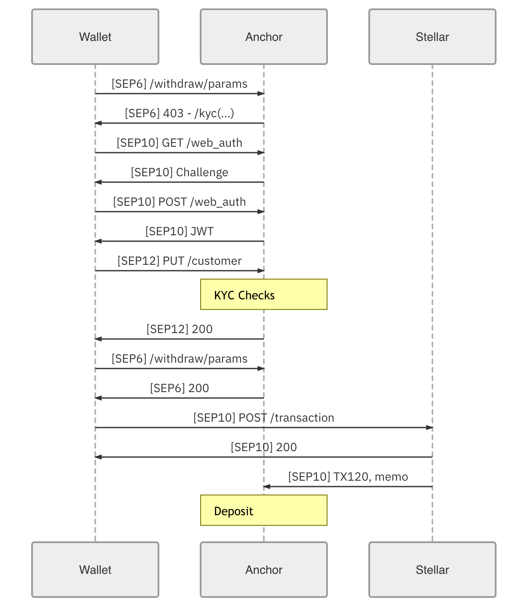

We're using [Mermaid](https://mermaidjs.github.io/#/) for diagrams.

````
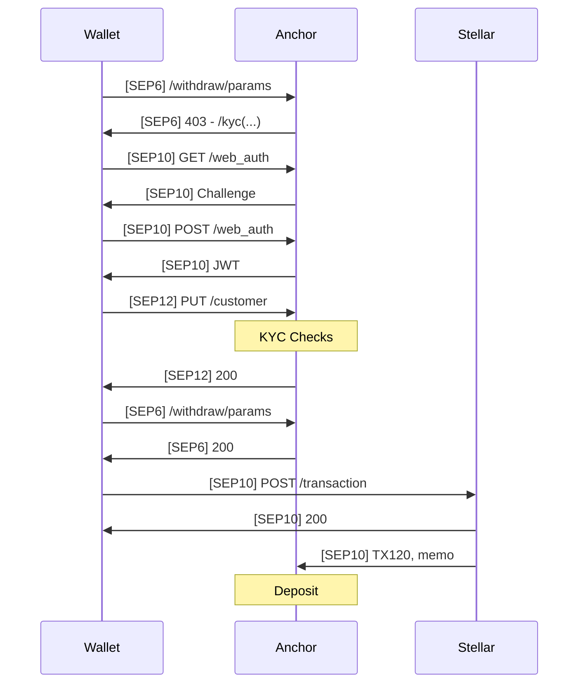
````

### Performance metrics

We have support for simple, anonymous metrics, emitted to Amplitude via
`helpers/metrics.js`.

We also have a simple performance tracking system, `helpers/performance.js`.
`mark(string)` will begin measuring, and `measure(string)` will stop measuring
and return timing information—an object with a `duration` and
`hasHighPrecision`. Some browsers don't expose the high-precision APIs, and we
definitely want to know if they're used (especially if not usable). Make sure to
use a `constants/performanceMarks` constant, not just a raw string.

### Testing requests as a crawler

Chrome allows you to
[override the user agent](https://developers.google.com/web/tools/chrome-devtools/device-mode/override-user-agent)
with DevTools, which enables us to test how Google will see pages.
