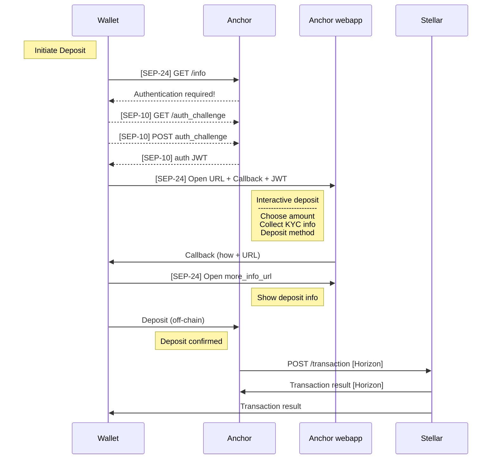
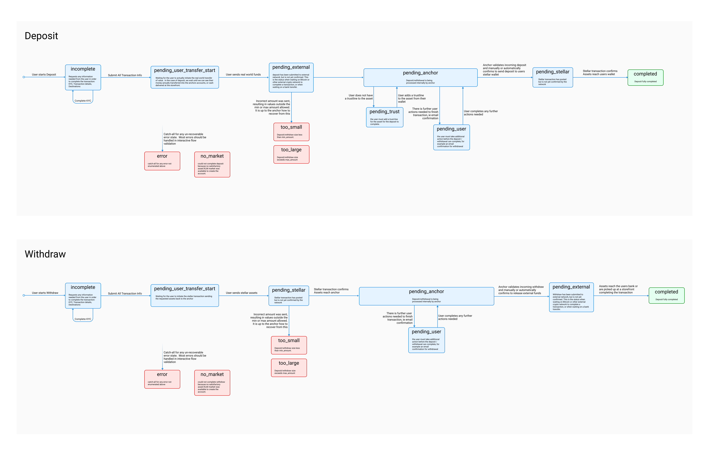
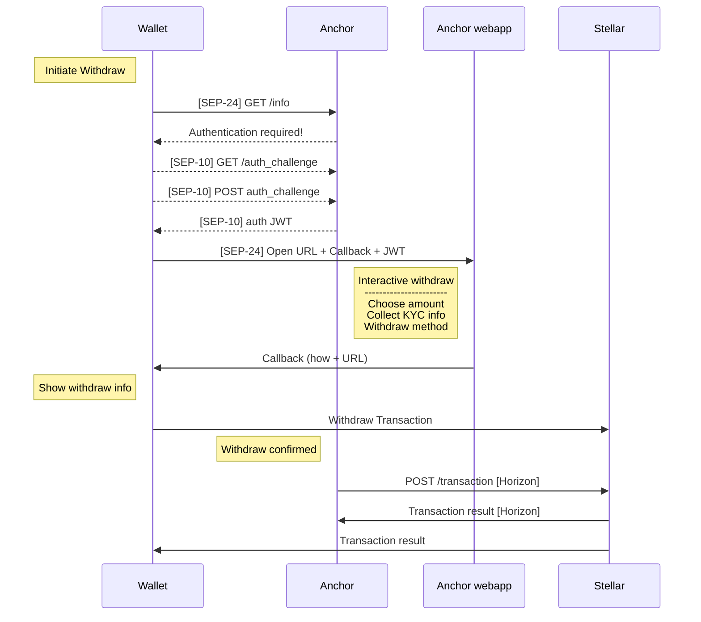

import { CodeExample } from "components/CodeExample";
import { Alert } from "components/Alert";

Before setting up a server that connects to live banking rails and real money, you should build out a test rig connected to the [Stellar test network](../glossary/testnet.mdx). The testnet works just like the main Stellar network, but it uses test data and allows you to fund test accounts for free using a tool called [Friendbot](../../glossary/testnet.mdx#friendbot).

<Alert>


Note: the testnet is reset every three months, so when building on it, make sure you have a plan to recreate necessary accounts and other data. For more info, check out the [best practices for using the testnet](../../glossary/testnet.mdx#best-practices-for-using-testnet).

</Alert>


At the end of this section, you should have a sandboxed system capable of interfacing with the Stellar testnet that you can easily convert into a production-ready deployment on the main Stellar network. You should always keep a testnet deployment up and running — even once you have a production version — so that wallets can test your implementation without the risk of losing real user funds.

You can also find an outline of the basic steps anchors need to complete in the [intro to SEP-24](https://github.com/stellar/stellar-protocol/blob/master/ecosystem/sep-0024.md#basic-anchor-implementation), the interactive deposit and withdrawal specification.

## Prerequisites

Before you start building infrastructure to connect a Stellar-network token to banking rails, you need to:

1. Issue an asset on the network – which you can find out how to do in the [Issue Assets](../../issuing-assets/index.mdx/) section — or find another trustworthy issuer and coordinate with them to broker their asset.
1. Add meta-information about the asset (if you issue one) and define the location of your `TRANSFER_SERVER_SEP0024` in your `stellar.toml` so that wallets know where to find the server and relevant endpoints. You can consult [this guide](../../issuing-assets/index.mdx/) for help completing your `stellar.toml`.

Once you've taken those steps, you're ready to implement an `/info` endpoint.

## Implementing the `/info` Endpoint

The `/info` endpoint allows anchors to communicate basic information to wallets, exchange interfaces, and other Stellar apps. It responds to client queries with a JSON object detailing which currencies the anchor supports for deposit and withdrawal, and laying out the fee structure for each currency.

Generally, anchors structure fees one of two ways:

- Fixed Fees: a fixed value that is applied to the transactions
- Fee Percent: a percentage of the transaction value

Since those are both pretty straightforward, the `/info` endpoint can convey those structures directly. If, however, you use a more complicated fee structure, you’ll need to use the `/fee` endpoint, and indicate it’s enabled in the `/info` response.

Here's an example `/info` response:

<CodeExample title="Example Info Response">


```json
{
  "deposit": {
    "USD": {
      "enabled": true,
      "fee_fixed": 5,
      "fee_percent": 1,
      "min_amount": 0.1,
      "max_amount": 1000
    },
    "ETH": {
      "enabled": true,
      "fee_fixed": 0.002,
      "fee_percent": 0
    }
  },
  "withdraw": {
    "USD": {
      "enabled": true,
      "authentication_required": true,
      "fee_minimum": 5,
      "fee_percent": 0.5,
      "min_amount": 0.1,
      "max_amount": 1000
    },
    "ETH": {
      "enabled": false
    }
  },
  "fee": {
    "enabled": false
  }
}
```

</CodeExample>


You can find the complete parameters for the `/info` endpoint in the Interactive Anchor/Wallet Asset Transfer Server spec (aka [SEP-24](https://github.com/stellar/stellar-protocol/blob/master/ecosystem/sep-0024.md)).

## Authentication

To provide a simpler experience for wallet users, anchors (aka on/off ramps) can authenticate individuals with their Stellar accounts instead of requiring usernames and passwords. The method for doing that is specified in the Stellar Web Authentication SEP (aka [SEP-10](https://github.com/stellar/stellar-protocol/blob/master/ecosystem/sep-0010.md)).

Stellar Web Authentication is a protocol for verifying that a user controls a Stellar private key for a given account, and for creating a persistent session for that user. It relies on a variation of mutual challenge-response, and uses Stellar transactions to encode challenges and responses: an asset issuer provides a 'challenge' transaction; the client signs it on behalf of the user and returns it to the issuer; the issuer checks that the signature is valid, and if it is, issues a JWT.

The JWT then acts as a reusable key for a client to perform an action on behalf of a user. It can contain an arbitrary amount of information, and is signed by the provider — in this case the asset issuer — to ensure validity. You can read the full spec [here](https://github.com/stellar/stellar-protocol/blob/master/ecosystem/sep-0010.md).

### Requesting a Challenge

To start the authentication flow, the client requests a challenge, which is a Stellar transaction with the sequence number set to 0. A transaction with a sequence number of 0 is, by definition, invalid, so it can't actually be submitted to the network. The issuer can, however, verify that the transaction is signed correctly (which is what happens in the next step).

The only information needed to request a challenge is the client's public key, passed as the `account` parameter. Here's an example: `GET <AUTH_ENDPOINT>?account=GXXXXXX`

### Exchanging the Signed Challenge

Once the client signs the challenge transaction on behalf of the user using standard [Stellar SDK tools](../../software-and-sdks/index.mdx), it sends the signed transaction back to the provider. Using those same Stellar SDKs, the provider then checks to see if the transaction is properly signed, and if it is, offers the client a JWT.

This JWT should be created with the claims that are appropriate given the account that signed the challenge. It can be created with any existing JWT library.

Here are the fields included in the JWT:

- The `sub` key contains the account of the authenticated user
- The `exp` key contains the expiration of the JWT. Some JWTs should be short-lived if the claims inside of it are expected to change, or if the JWT is used in less secure environments
- Other keys can contain any type of claim or data the Anchor wishes.

Since the `sub` field contains the address of the authenticated user, it's kind of like a username. The JWT authenticates said user.

Since some tokens are used in less secure environments, such as as query parameters in URLs, you may want to create a short-lived or one-time use token to prevent a JWT from falling into the wrong hands.

## Deposit Flow

Once you have implemented an `/info` endpoint and set up for user authentication, your next step is to set up a deposit flow. The deposit flow is the on-ramp to the Stellar Network. In it, a user transfers funds via local rails to a stablecoin issuer in return for a digital version of those funds on the Stellar Network. This section will go through all the steps necessary to implement a working deposit functionality.

Deposit flows involve a back-and-forth between an issuer's server and a wallet's client that starts with the wallet polling the `/info` endpoint and setting up an authenticated user session as described in the previous sections. The general sequence of deposit events looks like this:



### The POST `/transactions/deposit/interactive` Endpoint

To start a new deposit transaction, the wallet POSTs to the `/transactions/deposit/interactive` endpoint and lets the issuer know the user’s Stellar account via the `account` parameter, and what type of asset the user plans to deposit via the `asset_code` parameter.

Those are the only required fields to initiate a deposit request, so that’s all we’ll cover here. To find out about other optional parameters you should support, check the [complete spec](https://github.com/stellar/stellar-protocol/blob/master/ecosystem/sep-0024.md#deposit).

### Initiate Interactive Flow

In the interactive flow, the anchor’s server responds to the wallet’s POST with the `interactive customer information needed` response detailed [here](https://github.com/stellar/stellar-protocol/blob/master/ecosystem/sep-0024.md#2-interactive-customer-information-needed). That response is a JSON object containing a URL that the wallet uses to open an issuer-hosted webapp, which is what the issuer uses to collect the information it needs from a user to complete a deposit. The reason this flow relies on an issuer-hosted webapp is that wallets can’t predict what type of information an issuer will need.

If authentication is required, it should be handled before kicking off the deposit by the server hosting the interactive flow, usually using a one-time-use JWT to start a backend persistent session as described in the [previous section](./#authentication). If you use [Polaris](./reference-implementations.mdx), authentication is handled for you.

When the flow is finished, the webapp should respond to the callback given by the client. This can be either a javascript `postMessage` call or a call to a wallet-provided URL. In native apps, this URL can have a custom protocol to call back to the opening app.

### Webapp Interface

The webapp is an interface that collects any information you need from the user, including KYC requirements and deposit information, such as amount. It doesn’t have to be complicated, but to provide a seamless user experience that aligns with wallets’ expectations, it should follow the UX guidelines described in this [Github repo](https://github.com/stellar/anchor-ux-guidelines). If you’ve already collected information from this user, you can either skip these screens or pre-fill them.

For testing purposes, it's important that the staging infrastructure allows third parties to complete the flow without a real bank account or phone number, and without transferring any real money. Each screen should be properly internationalized using either an existing customer's preferences or the optional `lang` parameter from the initial `POST /transactions/deposit/interactive` call.

### More_info_url

The `more_info_url` is a parameter returned by the `/transactions/deposit/interactive` endpoint that is vital to complete deposits that require a bank transfer. It is automatically opened by wallets once the interactive flow is complete, and should have information on the bank account that the user should send the funds to.

After the Anchor confirms that the user has sent the transfer, this page can be used to show more information about the transaction. The `more_info_url` is relative to a single transaction, and it's used throughout the endpoints as a way for users to get more data on that specific entry.

The `more_info_url` should be a standalone page that users can also visit after the interactive flow is complete (not necessarily right after), since it's common for people to only be able to start the actual bank transfer a while after they've started the deposit process in the webapp and wallet interfaces.

## Transaction(s) Endpoints

The `/transaction` and `/transactions` endpoints provide a way for wallets to fetch information about a single transaction (to check its status) and about all transactions that belong to a user account (in order to show a historical view of their operations) respectively.

Wallets poll the `/transaction` endpoint when waiting for a transaction’s status to change. For example, when a user has initiated a withdrawal, the wallet will poll the relevant transaction after sending all the required information to the issuer for processing. Once the transaction is completed on the Stellar network, the transaction’s status will update from “pending_stellar” to “completed.” Through polling, the wallet knows to notify the user of the successful withdrawal.

Wallets need access to the transactions associated with the user’s account for displaying history or past activity. This can be accomplished with a `/transactions` endpoint. Wallets may also use this endpoint after making a POST request to `/transactions/deposit/interactive` to make sure a transaction was successfully created.



### Transactions History Endpoint

The `/transactions` endpoint should accept a number of parameters for filtering the transactions returned in the response. Refer to the [transaction history section of the SEP](https://github.com/stellar/stellar-protocol/blob/master/ecosystem/sep-0024.md#transaction-history) for a complete list of parameters and response values.

It should also be noted that the JSON object representation of a particular transaction should be the same in response to both `/transaction` and `/transactions`.

### Single Historical Transaction Endpoint

The `/transaction` endpoint should return a single JSON object representing the specified transaction. Unlike the filtering parameters for `/transactions`, this endpoint should accept the various identifiers for a particular transaction. Again, refer to the [SEP](https://github.com/stellar/stellar-protocol/blob/master/ecosystem/sep-0024.md#single-historical-transaction) for a complete spec.

## Withdrawal Flow

The withdrawal flow is the off-ramp from the Stellar Network. In it, a user makes a payment on the Stellar network to return digital assets to an anchor, and receives the equivalent value as fiat currency from the anchor in their bank account in return. This section will go through all the steps necessary to implement working withdrawal functionality.

Like deposit flows, withdraw flows involve a back-and-forth between an anchor’s server and a wallet’s client that starts with the wallet polling the `/info` endpoint and setting up an authenticated user session as described in the previous sections. The general sequence of deposit events looks like this:



### `/transactions/withdraw/interactive` Endpoint

Before initiating a withdrawal, a wallet hits the anchor’s `/info` endpoint and creates an authenticated user session as described in the [previous section](./#authentication). Once that’s done, a wallet makes a POST request to an issuer’s `/transactions/withdraw/interactive` endpoint to start a withdrawal, which creates a new but incomplete transaction record in the issuer’s database. The issuer’s response to the request should contain the transaction’s ID as well as the URL that should be requested to begin the interactive flow.

The webapp then collects the information necessary to complete the transaction.

The only required parameter for a withdraw query is `asset_code`, however you will likely want to collect `account` as well. Another notable parameter is `lang`. This parameter can be used on the deposit and info endpoints as well, and should be supported if you intend to serve users who speak different languages. Polaris supports English, Spanish, and Portuguese out of the box.

For an exhaustive list of the parameters and response values check out the [withdraw section](https://github.com/stellar/stellar-protocol/blob/master/ecosystem/sep-0024.md#withdraw) of the Interactive Anchor/Wallet Transfer Server SEP.

### Initiate Interactive Flow

The response to the wallet’s POST request to the `/transactions/withdraw/interactive` endpoint provides a URL. Since this URL will be requested as if in a browser (via popup or iframe), authentication headers cannot be added. DO NOT include the SEP-10 JWT token in the URL for authentication for the interactive flow, as this is considered insecure.

[Polaris](./reference-implementations.mdx) gets around this issue by adding a short-lived JWT token to the URL and using session cookies for the remainder of the interactive flow to identify the authenticated user. If you’re not using Polaris, feel free to implement your own authentication mechanisms for the interactive flows, but reference [SEP-24](https://github.com/stellar/stellar-protocol/blob/master/ecosystem/sep-0024.md#authentication) for guidance.

### Mocked Interface

There are a number of UI pages that should be served to the user while walking through the withdraw flow. These pages can be divided into three separate categories or phases.

- Mocked KYC: When starting a withdrawal, the anchor may be legally obligated to collect specific information from the user. In the testing phase, you don’t need to store this information permanently, but you still need to provide the interface to collect it. There is no restriction on the number of pages used, but often, you can get all you need with a single page. Make sure you understand relevant legal requirements before implementing this phase of the process.
- Withdrawal information: The issuer needs to collect the numerical amount of the asset to transfer. There may be other pieces of data you want to collect as well. Make sure you have all the information necessary to submit a successful transaction to the stellar network.
- Waiting for transfer: Once the issuer has collected all the information needed for a withdrawal, the last page rendered in the interactive flow should make a `postMessage` call to the Wallet, notifying the wallet that it has all the information it needs.

The wallet then submits the transaction to the Stellar network that sends tokens from the user’s Stellar account to the issuer’s Stellar account, andl begins polling the issuer’s `/transaction` endpoint until the relevant transaction has the expected status. For withdrawals, the expected status is “complete.”

The issuer should detect that the wallet has submitted a withdrawal transaction by streaming transaction events for the user’s account. Once a matching transaction has been detected, the issuer should mark the transaction as “complete” if it succeeds on the Stellar network, or “error” if there was a problem.
