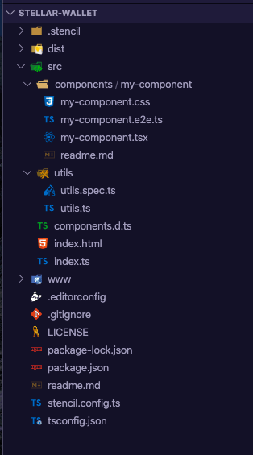
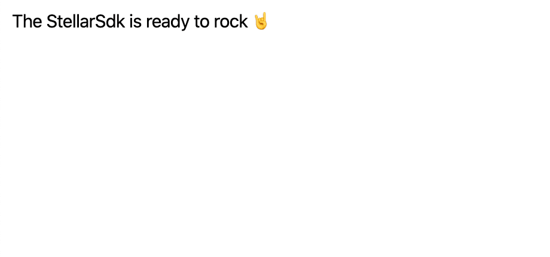

Throughout this tutorial we'll be making use of a little toolchain called StencilJs. It takes the best of modern frontend frameworks and pares everything back to small, blazing fast, 100% standards-based Web Components that run in every browser. Don’t worry if you've never heard of it: it's just TS (JS), SCSS (CSS) and JSX (HTML). You should be able to follow along just fine if you've ever built something with modern web dev tools.

We chose Stencil so you can learn by doing: it’s an easy way to create a web-based application, which means you can see the ins and outs of building a Stellar wallet start to finish.  Stellar also has a [suite of SDKs][1] in various programming languages, so if Javascript isn’t your thing, you can follow along, and recreate the steps below using one of them. 

To start the setup, open your terminal and initialize a new project.

```bash
npm init stencil
```
After running `init` you will be provided with a prompt to choose the type of project to start. While Stencil can be used to create entire apps, we’ll choose the component as we’ll just be dealing with modular components rather than building an entire application

```bash
? Pick a starter › - Use arrow-keys. Return to submit.

   ionic-pwa     Everything you need to build fast, production ready PWAs
   app           Minimal starter for building a Stencil app or website
❯  component     Collection of web components that can be used anywhere
```

We’ll walk through the prompt, `cd` into the project and run `npm i ; npm start`

```bash
✔ Pick a starter › component
✔ Project name › stellar-wallet

✔ All setup  in 9 ms

  $ npm start
    Starts the development server.

  $ npm run build
    Builds your components/app in production mode.

  $ npm test
    Starts the test runner.

  We suggest that you begin by typing:

   $ cd stellar-wallet
   $ npm i
   $ npm start

  Further reading:

   - https://github.com/ionic-team/stencil-component-starter

  Happy coding! 🎈
```

Now that our project is initialized, let’s take a look at the directory structure and familiarize ourselves with where things are and what roles they play.

![][image-1]

We’re mostly interested in the `src/` directory. The `dist/` and `www/` directories are outputs for compiled code. In the `src/components/` directory you’ll see a `my-component/` folder. We’re about to generate our own component, so go ahead and delete that folder. You can also nuke the `utils/` directory as we won’t be covering tests in this tutorial. Now run:

```bash
$ npm run generate
```
This will initialize a component generation script. Enter a name of `stellar-wallet`. Disable Spec Test and E2E Test as we’re not interested in those Stencil features today. Press Return and your component will generate and wire up.

```bash
% npm run generate

> stellar-wallet generate
> stencil generate

✔ Component tag name (dash-case): … stellar-wallet
✔ Which additional files do you want to generate? › Stylesheet

$ stencil generate stellar-wallet

The following files have been generated:
  - src/components/wallet/wallet.tsx
  - src/components/wallet/wallet.css
```

Amazing! Just a few more setup bits and we can get coding. I don’t know about you but I prefer to style in SCSS rather than CSS so let’s get some modern CSS dev tools setup.

```bash
npm i -D @stencil/postcss @stencil/sass autoprefixer @types/autoprefixer rollup-plugin-node-polyfills
```
Once those packages have successfully installed, hop over to the `stencil.config.ts` file at the root of the project and modify it to this:

```js
import { Config } from '@stencil/core'
import { sass } from '@stencil/sass'
import { postcss } from '@stencil/postcss'
import autoprefixer from 'autoprefixer'
import nodePolyfills from 'rollup-plugin-node-polyfills'

export const config: Config = {
  namespace: 'stellar-wallet',
  outputTargets: [
    {
      type: 'dist',
      esmLoaderPath: '../loader'
    },
    {
      type: 'docs-readme'
    },
    {
      type: 'www',
      serviceWorker: null // disable service workers
    }
  ],
  globalStyle: 'src/global/style.scss',
  commonjs: {
    namedExports: {
      'stellar-sdk': ['StrKey', 'xdr', 'Transaction', 'Keypair', 'Networks', 'Account', 'TransactionBuilder', 'BASE_FEE', 'Operation', 'Asset', 'Memo', 'MemoHash'],
      '@stellar/wallet-sdk': ['KeyManager', 'KeyManagerPlugins', 'KeyType'],
    },
  },
  plugins: [
    nodePolyfills(),
    sass(),
    postcss({
      plugins: [autoprefixer()]
    })
  ],
  nodeResolve: {
    browser: true,
    preferBuiltins: true
  }
}
```

With that file saved, pop over to the `src/components/wallet/` and rename the `wallet.css` to `wallet.scss`. While we’re here let’s go ahead and modify this new style file with some basic styling to put our project in a pretty place.

```scss
@import '../../global/style.scss';

:host {
  display: block;
  font-family: $font-family;
  font-size: 15px;

  p {
    white-space: nowrap;
    overflow: hidden;
    text-overflow: ellipsis;
    display: block;
  }
  button {
    margin-bottom: 10px;
  }

  .account-key {
    display: flex;
    align-items: center;
    width: 100%;
    margin-bottom: 10px;

    .small {
      margin: 0 0 0 10px;
      flex-shrink: 0;
    }
  }
  .account-state,
  .error {
    overflow: scroll;
    padding: 10px;
    font-size: 12px;
    line-height: 1.2;
    font-family: $font-mono;
    margin-bottom: 10px;
    width: 100%;
  }
  .account-state {
    background-color: whitesmoke;
  }
  .error {
    background-color: orangered;
    color: white;
  }

  stellar-loader {
    position: absolute;
    top: 50%;
    left: 50%;
    transform: translate(-50%, -50%);
  }
}
```

Before we update our `wallet.tsx` with this new stylesheet, note that we’re also importing a global stylesheet.  Go ahead and create that file at the root of the `src/` directory. So `src/global/style.scss`.

```scss
$font-family: -apple-system,BlinkMacSystemFont,Segoe UI,Helvetica,Arial,sans-serif,Apple Color Emoji,Segoe UI Emoji;
$font-mono: monospace;

html, body, div, span, applet, object, iframe,
h1, h2, h3, h4, h5, h6, p, blockquote, pre,
a, abbr, acronym, address, big, cite, code,
del, dfn, em, img, ins, kbd, q, s, samp,
small, strike, strong, sub, sup, tt, var,
b, u, i, center,
dl, dt, dd, ol, ul, li,
fieldset, form, label, legend,
table, caption, tbody, tfoot, thead, tr, th, td,
article, aside, canvas, details, embed,
figure, figcaption, footer, header, hgroup,
menu, nav, output, ruby, section, summary,
time, mark, audio, video {
  margin: 0;
  padding: 0;
  border: 0;
  font-size: 100%;
  font: inherit;
  vertical-align: baseline;
}
/* HTML5 display-role reset for older browsers */
article, aside, details, figcaption, figure,
footer, header, hgroup, menu, nav, section {
  display: block;
}
body {
  line-height: 1;
}
ol, ul {
  list-style: none;
}
blockquote, q {
  quotes: none;
}
blockquote:before, blockquote:after,
q:before, q:after {
  content: '';
  content: none;
}
table {
  border-collapse: collapse;
  border-spacing: 0;
}

* {
  box-sizing: border-box;
}
input,
button,
select,
textarea {
  font-family: $font-family;
  font-size: 15px;
  outline: none;
  appearance: none;
  border-radius: 0;
}
input,
select,
button {
  height: 30px;
}
button {
  border: none;
  appearance: none;
  position: relative;
  background-color: blue;
  color: white;
  margin: 0;
  display: flex;
  align-items: center;
  align-content: center;
  justify-content: center;
  justify-items: center;
  padding: 0 10px;
  cursor: pointer;

  &.loading {
    color: transparent;
    pointer-events: none;
  }
  &.small {
    font-size: 12px;
    height: 20px;
  }
}
```

Save those style files and update the `wallet.tsx` to point to our new styles like so:

```tsx
import { Component, h } from '@stencil/core'
import * as StellarSdk from 'stellar-sdk'

@Component({
  tag: 'stellar-wallet',
  styleUrl: 'wallet.scss',
  shadow: true
})
export class Wallet {
  render() {
    return [
      <h1>
        {
        !!StellarSdk
        ? 'The StellarSdk is ready to rock 🤘'
        : 'Uh oh, the StellarSdk is missing 😱'
        }
      </h1>
    ]
  }
}
```

You’ll notice we also include a few extra setup lines to get the StellarSdk loaded in and ready to use. Let’s ensure all those dependencies are loaded and ready to rock.

```bash
npm i -D stellar-sdk js-xdr
```
The last mod: point the `src/index.html` file to use this brand new component. Modify that file to match this.

```html
<!DOCTYPE html>
<html dir="ltr" lang="en">
<head>
  <meta charset="utf-8">
  <meta name="viewport" content="width=device-width, initial-scale=1.0, minimum-scale=1.0, maximum-scale=1.0">
  <title>Stellar Wallet</title>

  <link rel="stylesheet" href="https://unpkg.com/reset-css/reset.css">
  <style>
    body {
      padding: 10px;
    }
  </style>

  <script type="module" src="/build/stellar-wallet.esm.js"></script>
  <script nomodule src="/build/stellar-wallet.js"></script>
</head>
<body>
  <stellar-wallet />
</body>
</html>

```

You should be all set up now.  Restart the server and let’s get coding.

```bash
# Stop any current server and rerun
$ npm start
```

![][image-2]

[View this code on GitHub][2]

[Prev][3] — [Next][4]

[1]:	link
[2]:	https://github.com/tyvdh/stellar-demo-wallet/tree/setup
[3]:	/0%20Stellar%20Wallet%20Overview/0%20Overview.md
[4]:	/1%20Create%20a%20Stellar%20Wallet/0%20Intro.md


