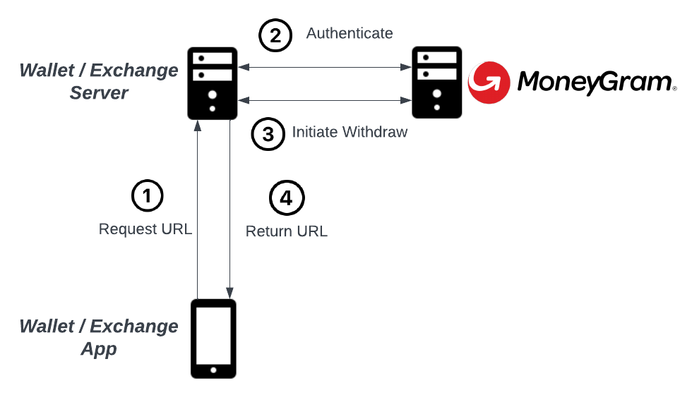
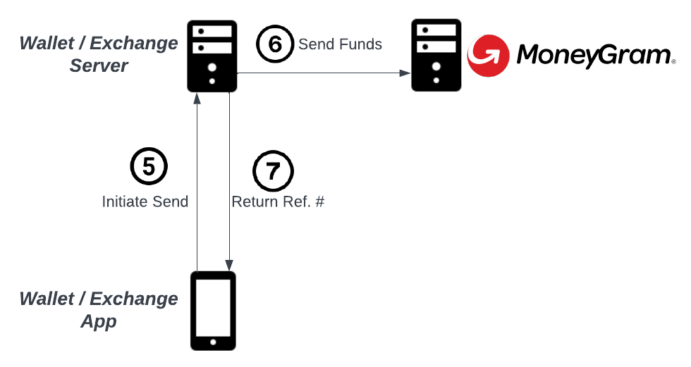

import { CodeExample } from "components/CodeExample";
import { Alert } from "components/Alert";

This document guides the reader through the technical requirements for integrating [MoneyGram Access] into an existing application. MoneyGram Access is a MoneyGram product that enables users of third-party applications, such as crypto wallets and exchanges, to cash-in (deposit) and cash-out (withdrawal) of Stellar USDC.

MoneyGram requires businesses to go through an onboarding process in order to get access to their testing and production environments. To get started with this process, reach out to partnerships@stellar.org.

## Resources

- [MoneyGram Access Wallet MVP Implementation]
  - Use this MVP implementation as a reference for building your own integration. Many of the code snippets shared in this document are pulled from this project.
- [Stellar Test Anchor]
  - Before getting access to MoneyGram's test environment, you can use the SDF's test anchor while developing your integration
- [Stellar Demo Wallet]
  - This application visualizes the API calls necessary to connect to a Stellar Anchor
- [Stellar Ecosystem Proposal 24 (SEP-24)][sep-24]
  - The standardized API protocol for Stellar on & off ramps, implemented by MoneyGram
- [Stellar Ecosystem Proposal 10 (SEP-10)][sep-10]
  - The standardized API protocol for Stellar authentication, implemented by MoneyGram

## Introduction

Applications seeking to integrate MoneyGram Access must implement the client side of [Stellar Ecosystem Proposal 24 (SEP-24)][sep-24], a standardized protocol defined for applications to connect to businesses such as MoneyGram, more generally called anchors, that offer Stellar deposit & withdrawal services utilizing local payment rails.

This document will walk you through the necessary steps to develop a functional implementation of this standard.

The guide will assume your application is first being developed on Stellar’s test network and using MoneyGram’s testing deployment of Access, but there are no functional differences deploying the application to Stellar’s public network and using MoneyGram’s production deployment.

This guide also assumes your application is custodial, meaning the application has either direct or indirect access to its users’ funds on Stellar. Typically, custodial applications pool user funds into a smaller set of managed Stellar accounts, called pooled, shared, or omnibus accounts. This custody model requires minor but concrete differences in how applications integrate with MoneyGram Access compared to non-custodial applications.

## Application Flow & Architecture

This guide will assume the application has a basic client-server architecture. The application’s client will request resources and initiate actions with the application’s server, which will communicate directly with MoneyGram’s server.

Below are the 7 high-level steps to take to facilitate a cash-out (withdrawal) transaction.



After Step 4, the application should open the URL provided by MoneyGram in a mobile webview or browser tab. MoneyGram will then prompt the user to provide KYC and transaction information. On completion of this flow, the application’s client should close the MoneyGram tab or webview and initiate the disbursement of funds.



The provided reference number would then be taken to any MoneyGram cash agent in order to receive cash in the user’s fiat currency. These steps document the cash-out, or withdrawal flow. The deposit flow is similar and detailed in the steps below.

## Generate Stellar Keypairs

In this section, you will generate at least two Stellar keypairs, one that will be used to prove your application’s identity when authenticating with MoneyGram Access, and another that will hold, send, & receive USDC on Stellar. You should always use one keypair for authentication, but application could use many keypairs for sending & receiving payments. In this guide, we'll assume the application uses one keypair for each purpose.

This section assumes that your application does not have any support for the Stellar network. If your application already supports deposits & withdrawals of XLM, you already have one or more Stellar accounts that can be used for these purposes, although it is heavily encouraged to use a new keypair for authentication.

Go to [Stellar Lab] and generate 2 keypairs. The secret keys should be handled securely, because they will be used to authenticate with and disburse funds to MoneyGram.

The first keypair will be called the “authentication” keypair (or public / secret key). The second keypair will be the “funds” keypair (or account, public key, or secret key). Unlike the authentication keypair, the funds keypair will reference a funded account on the Stellar network. The authentication keypair does not need to funded.

Provide the public keys (starting with a G) of both the authentication and funds keypairs to MoneyGram. They will add these keys to their known lists of keys, granting them access to their deployment.

## Get XLM & USDC

Many cryptocurrency exchanges support purchasing XLM or USDC on Stellar. The SDF also maintains an [Anchor Directory] that attempts to list all the on & off-ramps for the Stellar Network.

When you’ve purchased XLM and / or USDC on an exchange, you can make a payment to an external account, specifically to the funds public key you generated in the previous step. Note that you will first need to send XLM to create the account, then add a USDC [trustline], then send the USDC. Creating a trustline to USDC can be done using [Stellar Lab] or any Stellar-enabled wallet application, such as [Lobstr].

Some exchanges support XLM but do not support USDC on Stellar. This is not a problem, because you can always sell XLM for USDC on Stellar’s decentralized exchange (or SDEX).

To do this, send your XLM to the funds public key from the exchange, add a USDC trustline, and sell XLM for USDC using a [sell offer].

## Authenticate

This section emcompasses steps 1 & 2 of the diagram displayed in the Architecture section above. The application’s client should request a MoneyGram transaction URL from the application’s server on user initiation. This should trigger an authentication process between the application’s server and MoneyGram’s server. This process is standardized in [SEP-10][sep-10].

This section assumes that the application’s server has the following pieces of information:

- The user’s integer ID (must be positive and represented using 64 bits or less) MoneyGram’s authentication endpoint
  - Testing: https://extstellar.moneygram.com/stellaradapterservice/auth
  - Production: https://stellar.moneygram.com/stellaradapterservice/auth
- MoneyGram’s authentication public key
  - Testing: `GCSESAP5ILVM6CWIEGK2SDOCQU7PHVFYYT7JNKRDAQNVQWKD5YEE5ZJ4`
  - Production: `GD5NUMEX7LYHXGXCAD4PGW7JDMOUY2DKRGY5XZHJS5IONVHDKCJYGVCL`
- The application’s authentication public and secret key

The flow can be described with the following steps:

1. The application requests an authentication challenge
2. The server (MoneyGram) provides the authentication challenge
3. The application verifies that MoneyGram signed the authentication with it's SIGNING_KEY
4. The application signs the authentication challenge with its own key
5. The application sends the authentication challenge back to the server
6. The server verifies the application signed the challenge with the account it initially used to request the challenge
7. The server returns a session token for the account & memo used in the initial authentication request

The following code demonstrates how to implement the application’s side of this flow. Note that this code does not handle retries in the event of network connection issues. It also does not handle unexpected status codes, and does not include logging or metrics.

<CodeExample>


```python
def get_token() -> str:
    query = f"{AUTH_URL}?account={AUTH_PUBLIC_KEY}&memo={USER_ID}"
    response = requests.get(query)
    body = response.json()
    challenge = read_challenge_transaction(
        challenge_transaction=body["transaction"],
        server_account_id=MGI_ACCESS_SIGNING_KEY,
        home_domains=MGI_ACCESS_HOST,
        web_auth_domain=MGI_ACCESS_HOST,
        network_passphrase=Network.TESTNET_NETWORK_PASSPHRASE
    )
    challenge.transaction.sign(AUTH_SECRET_KEY)
    post_body = {
        "transaction": challenge.transaction.to_xdr()
    }
    response = requests.post(f"{AUTH_URL}", json=post_body)
    response_body = response.json()
    return response_body["token"]
```

</CodeExample>


## Initiate a Transaction

This section encompasses steps 3 & 4 of the architecture diagram displayed above. The application’s server will make a deposit or withdrawal initiation request to MoneyGram’s server, and MoneyGram will return a transaction ID, which will be used later to poll the transaction’s status, and a transaction URL, which should be returned to the application’s client and opened for the user.

For the purpose of this guide, we will go through the withdrawal case.

You will need the following pieces of information:

- The authentication token provided by MoneyGram. This token can only be used for actions associated with the user identified by the ID used in the previous steps.
- The public key of the keypair the application will use to send funds
- The language code MoneyGram should render their UI’s content with
- The amount the user would like to withdraw / cash-out
  - This should be collected from the user prior to initiating this transaction

The following code can be used as a reference for implementing this logic yourself. This code is not necessarily production-ready.

<CodeExample>


```python
def initiate_withdraw(token: str, amount: str) -> Tuple[str, str]:
    post_body = {
        "asset_code": ASSET_CODE, # USDC
        "account": FUNDS_STELLAR_KEYPAIR.public_key,
        "lang": "en",
        "amount": amount
    }
    response = requests.post(
        MGI_ACCESS_WITHDRAW_URL,
        json=post_body,
        headers={
            "Authorization": f"Bearer {token}"
        }
    )
    body = response.json()
    return body["url"] + "&callback=postmessage", body["id"]
```

</CodeExample>


The logic for initiating a deposit transaction looks very similar. See the [SEP-24][sep-24] standard specification for detailed information. MoneyGram requires the `amount` field in both cases.

The `&callback=postmessage` query parameter added to the returned URL is critical; it informs MoneyGram that the application’s client would like to be notified when the user has completed the MGI experience and has requested to close the window. We’ll cover this in more detail in the subsequent section.

## Listen for the Close Notification

The next step is to open the provided URL in the application’s client using a mobile webview, browser tab, or popup. The user will then go through KYC if they have not before in a prior transaction. In the deposit case, the user may also select a MoneyGram agent location to go to when providing cash.

Finally, when the user is done with the MoneyGram UI, the user will select a button displayed on MoneyGram’s UI and MoneyGram will send a [postMessage] to the window or app that opened its flow initially. The message sent will be the SEP-24 transaction JSON object that represents the transaction.

Below is a simple JavaScript example listening for a postmessage notification.

<CodeExample>


```javascript
webview = window.open(moneygramURL, "webview", "width=500,height=800");
window.addEventListener("message", closeWebView);

function closeWebView(e) {
  webview.close();
  const txJson = e.data.transaction;
  console.log(`Transaction ${txJson.id} is ${txJson.status}`);
}
```

</CodeExample>


## Send or Receive Funds

In withdrawal (or cash-out) transactions, applications must send USDC to the Stellar account MoneyGram specifies. In deposit (cash-in) transactions, applications must monitor their Stellar account for a payment from MoneyGram.

In each case, the transaction submitted to Stellar must have a memo attached to it. This memo is provided by MoneyGram in the withdrawal case, and provided by the application in the deposit case. The memo is an identifier that allows the parties to tie the on-chain payment to the transaction record in the application’s or MoneyGram’s database.

### Poll Until MoneyGram is Ready

Before the application can send funds or instruct the user to provide cash to a MoneyGram agent, the application should confirm with MoneyGram’s server that the transaction is ready to proceed.

You will need the following information to do so.

- The authentication token provided by MoneyGram
- The transaction’s ID provided by MoneyGram
- MoneyGram’s transaction’s endpoint
  - Testing: https://extstellar.moneygram.com/stellaradapterservice/sep24/transaction
  - Production: https://stellar.moneygram.com/stellaradapterservice/sep24/transaction

This code uses a simple polling mechanism with no bail-out condition. The application’s code should be more robust.

<CodeExample>


```python
response_body = poll_transaction_until_status(
    transaction_id,
    token=token,
    until_status="pending_user_transfer_start"
)

def poll_transaction_until_status(
    txid: str,
    token: str,
    until_status: str
) -> dict:
    first_iteration = True
    response_body = None
    status = None
    while status != until_status:
        if first_iteration:
            first_iteration = False
        else:
            time.sleep(1)
        query = f"{MGI_ACCESS_TRANSACTION_URL}?id={txid}"
        response = requests.get(
            query,
            headers={
                "Authorization": f"Bearer {token}"
            }
        )
        response_body = response.json()
        status = response_body["transaction"]["status"]
    return response_body
```

</CodeExample>


### Sending Funds

Once MoneyGram is ready to receive funds, your application should extract the Stellar account and memo to use in the payment transaction, construct a Stellar transaction, and submit it to the Stellar network. You’ll need:

- A copy of MoneyGram’s transaction object
- The application’s funds public & secret key

Code for submitting transactions to Stellar should be developed thoughtfully. The SDF has a documentation page dedicated to [submitting transactions and handling errors gracefully]. Here are a few things you need to keep in mind:

- Offer a high fee. Your fee should be as high as you would offer before deciding the transaction is no longer worth sending. Stellar will only charge you the minimum necessary to be included in the ledger -- you won't be charged the amount you offer unless everyone else is offering the same amount or greater. Otherwise, you’ll pay the smallest fee offered in the set of transactions included in the ledger.
- Set a maximum timebound on the transaction. This ensures that if your transaction is not included in a ledger before the set time, you can reconstruct the transaction with a higher offered fee and submit it again with better chances of inclusion.
- Resubmit the transaction when you get 504 status codes. 504 status codes are just telling you that your transaction is still pending -- not that it has been canceled or that your request was invalid. You should simply make the request again with the same transaction to get a final status (either included or expired).

Below is highly simplified code for submitting a payment transaction. It does not use timebounds, handle a transaction’s expiration, or handle 504 status codes.

<CodeExample>


```python
submit_payment(
   destination=response_body["transaction"]["withdraw_anchor_account"],
   memo=response_body["transaction"]["withdraw_memo"],
   amount=response_body["transaction"]["amount_in"]
)

def submit_payment(destination: str, memo: str, amount: str):
   server = Server()
   account = server.load_account(FUNDS_STELLAR_KEYPAIR.public_key)
   transaction = TransactionBuilder(
       source_account=account,
       network_passphrase=Network.TESTNET_NETWORK_PASSPHRASE,
       base_fee=10000  # this is 0.001 XLM
   ).append_payment_op(
       destination=destination,
       asset=Asset(ASSET_CODE, ASSET_ISSUER),
       amount=amount,
   ).add_memo(
       IdMemo(int(memo))
   ).build()
   transaction.sign(FUNDS_STELLAR_KEYPAIR)
   response = server.submit_transaction(transaction)
   print(f"Stellar-generated transaction ID: {response['id']}")
```

</CodeExample>


### Receiving Funds

Once MoneyGram is ready for the user to drop off cash at an MGI agent (in deposit or cash-in cases), the application’s server should begin monitoring its Stellar account for an inbound USDC payment sent by MoneyGram.

The application should have provided a memo for MoneyGram to use when it initiated the deposit. MoneyGram will attach this memo to the transaction used to send the payment to the application, and the application should use this check the memo of transactions involving it’s account to associate the payment back to the user and the specific transaction.

The best way to monitor payments made to an account is to stream events from Stellar’s payments endpoint. The use of streaming cursors can help ensure you never miss an event, even if your application’s streaming process goes down for a period of time.

Note that this code does not handle [path payments] or [claimable balances], two slightly different forms of payment. At the time of writing, MoneyGram does not use either of these options, but you may want to add support for them in case they do in the future.

<CodeExample>


```python
def stream_payments(account: str, cursor: str):
    s = Server()
    payments = s.payments().for_account(account).join("transactions")
    for payment in payments.cursor(cursor).stream():
        if (
            payment["type"] != "payment"
            or payment["from"] == account
            or payment["asset_type"] == "native"
            or payment["asset_code"] != "USDC"
            or payment["asset_issuer"] != USDC_ISSUER
        ):
            continue
        transaction = get_transaction_by_memo(
            payment["transaction"]["memo"],
            payment["transaction"]["memo_type"]
        )
        if not transaction:
            continue
        print(
            f"Payment for deposit transaction {transaction.id} "
            "matched with Stellar transaction "
            f"{payment['transaction']['id']}"
        )
```

</CodeExample>


## Fetch the Reference Number

For deposit or cash-in transactions, MoneyGram does not provide reference numbers. All the user needs to do is drop off cash at the agent location chosen in the MoneyGram UI earlier in the flow, and the application should complete the transaction when a matching payment is detected on Stellar.

For withdrawal or cash-out transactions, MoneyGram provides a reference number in their UI and API once MoneyGram detects the application’s payment of USDC on Stellar. Users should be able to use the application’s client interface to view the reference number directly or find the MoneyGram transaction details page and view it there.

Note that MoneyGram’s transaction details page is protected with a JWT token in the url that expires relatively quickly after being fetched. This means applications must fetch the URL at the time the user requests the page, potentially requiring re-authentication via SEP-10.

<CodeExample>


```python
response_body = poll_transaction_until_status(
    transaction_id,
    "pending_user_transfer_complete"
)
tx_dict = response_body["transaction"]
print(
    f"Transaction reference number {tx_dict['external_transaction_id']} "
    f"also viewable at {tx_dict['more_info_url']}"
)
```

</CodeExample>


[moneygram access]: https://stellar.org/moneygram?locale=e
[moneygram access wallet mvp implementation]: https://github.com/stellar/moneygram-access-wallet-mvp
[stellar test anchor]: https://testanchor.stellar.org/.well-known/stellar.toml
[stellar demo wallet]: https://demo-wallet.stellar.org
[sep-24]: https://github.com/stellar/stellar-protocol/blob/master/ecosystem/sep-0024.md
[sep-10]: https://github.com/stellar/stellar-protocol/blob/master/ecosystem/sep-0010.md
[stellar lab]: https://laboratory.stellar.org/
[anchor directory]: https://resources.stellar.org/anchors?
[lobstr]: https://lobstr.co/
[trustline]: https://developers.stellar.org/api/resources/operations/object/change-trust/
[sell offer]: https://developers.stellar.org/api/resources/operations/object/sell-offer/
[postmessage]: https://developer.mozilla.org/en-US/docs/Web/API/Window/postMessage
[submitting transactions and handling errors gracefully]: https://developers.stellar.org/docs/tutorials/handling-errors/
[path payments]: https://developers.stellar.org/api/resources/operations/object/path-payment-strict-receive/
[claimable balances]: https://developers.stellar.org/api/resources/operations/object/create-claimable-balance/
[moneygram screening questionnaire]: https://stellarquestionnaire.typeform.com/to/RD1a71wQ
